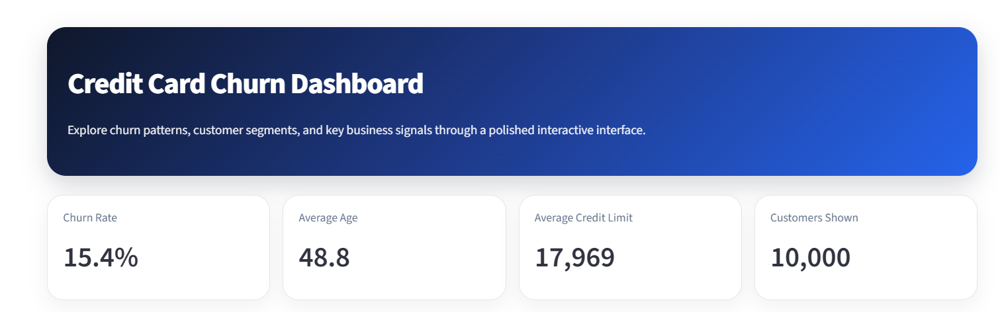
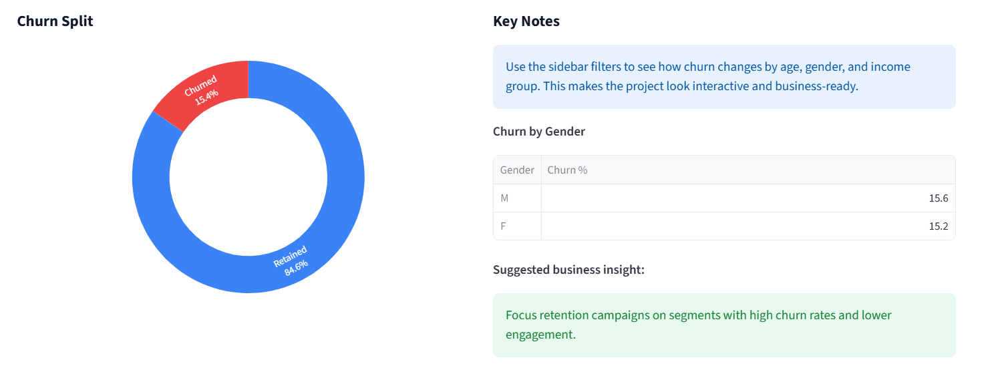
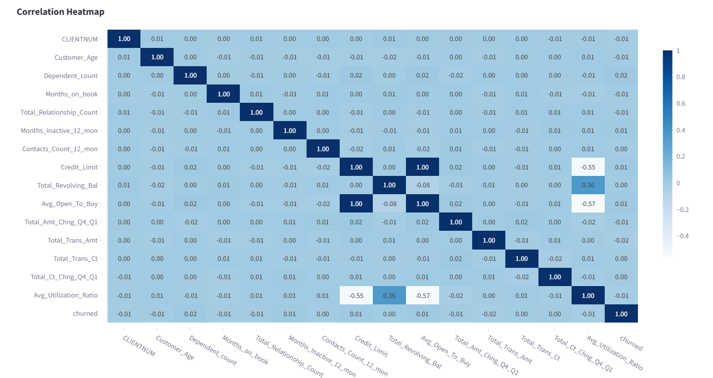

# 💳 Credit Card Churn Prediction Dashboard

A polished end-to-end data science project that explores **credit card customer churn**, identifies key churn drivers, and presents the findings in an interactive **Streamlit dashboard**. 

--- 

## 📸 Screenshots

### 🏠 Dashboard Home

### 📊 Churn Split

### 🧠 Correlation Heatmap

---

## 🌟 Project Highlights

* 📊 **Exploratory Data Analysis** on customer behavior and churn patterns
* 🧹 **Data cleaning** and feature preparation
* 🧠 **Machine learning model** for churn prediction
* 🖥️ **Interactive Streamlit UI** with charts, filters, and insights
* 📁 Clean project structure for portfolio presentation

---

## 🎯 Problem Statement

Banks and credit card companies want to identify customers who are likely to leave so they can take action early.

This project answers:

* Which customer groups churn the most?
* What features are most related to churn?
* Can we predict churn using customer behavior and profile data?

---

## 🧰 Tech Stack

* **Python**
* **Pandas**
* **NumPy**
* **Matplotlib / Seaborn**
* **Plotly**
* **Scikit-learn**
* **Streamlit**
* **SQL**
* **Jupyter Notebook**

---

## 🔎 EDA Summary

* Churn rate varies across customer segments
* Certain behavioral features are more associated with churn
* Customer age, income, and transaction activity help explain churn patterns
* Visual exploration supports the business story behind retention

---

## 🤖 Modeling Approach

* Target variable: **churned**
* Baseline model: **Logistic Regression**
* Stronger model: **Random Forest**
* Evaluation metrics:

  * ROC AUC
  * Confusion Matrix
  * Precision / Recall / F1-score

---

## 📈 Key Insights

* Customers with lower engagement can show higher churn risk
* Income and activity patterns may separate stable users from churn-prone users
* Business teams can use this analysis to target retention campaigns

---

## 🧪 SQL Used

The `SQL/queries.sql` file includes queries for:

* churn counts
* churn rate by segment
* average credit limit by churn status
* categorical breakdowns

---

## 📌 Future Improvements

* Add SHAP explanations for model transparency
* Deploy the app publicly
* Add more model comparison
* Include automated reporting

---

## 👨‍💻 Author

Krish Shah

---

## ⭐ If you liked this project

Feel free to explore the code, run the dashboard, and review the analysis. This project was built as a portfolio-ready data science case study.
